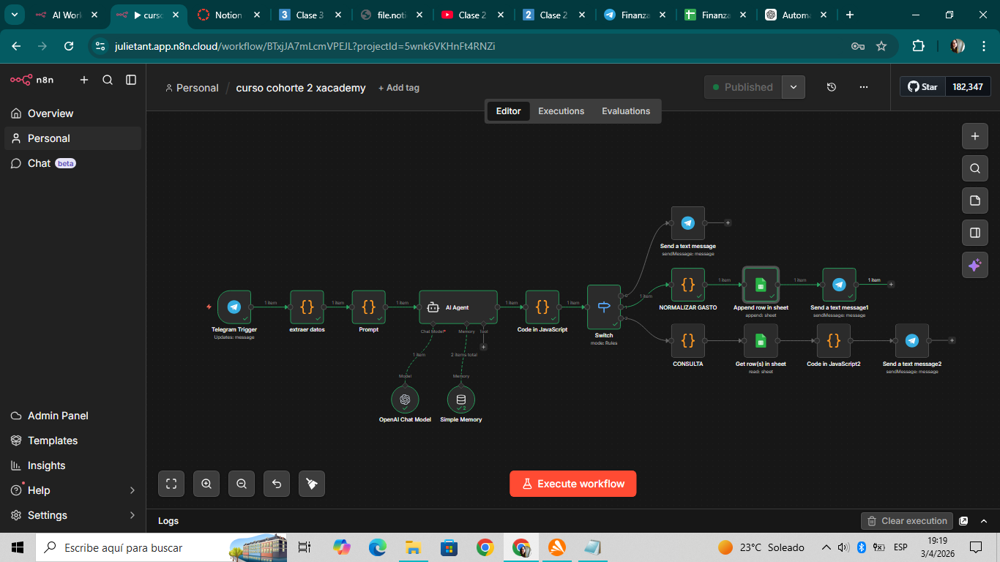
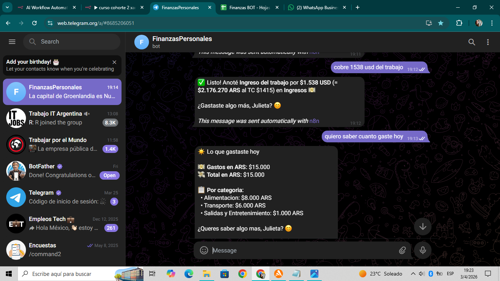
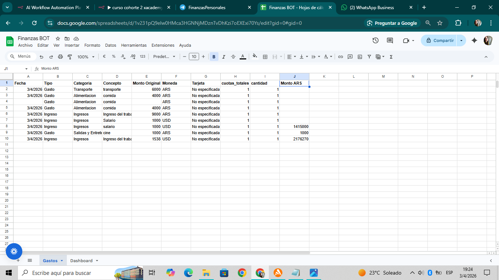
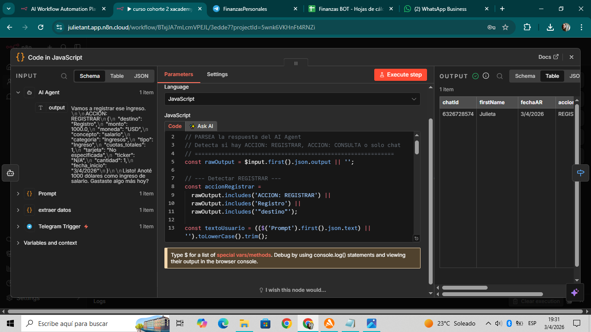

# bot-finanzas-n8n
# 🤖 Bot de Finanzas Personales con n8n + IA

Este proyecto consiste en un bot de Telegram que permite registrar gastos e ingresos en lenguaje natural, almacenarlos automáticamente y consultarlos en tiempo real.

---

## 🚀 Funcionalidades

- Registro de gastos e ingresos mediante mensajes
- Interpretación de lenguaje natural con IA
- Clasificación automática (gasto / ingreso)
- Soporte para múltiples monedas (ARS / USD)
- Conversión automática de USD a ARS mediante API
- Almacenamiento en Google Sheets
- Consultas en tiempo real (ej: "cuánto gasté hoy")

---

## 🧠 Tecnologías utilizadas

- n8n (workflow automation)
- OpenAI / AI Agent
- Telegram Bot API
- Google Sheets API
- JavaScript (nodos de procesamiento)

---

## 🔄 Flujo de trabajo

1. El usuario envía un mensaje por Telegram
2. El bot interpreta la intención (chat / registro / consulta)
3. Se procesa la información (normalización y validación)
4. Se almacena en Google Sheets
5. Se responde al usuario

---

## 📸 Ejemplo de funcionamiento

### 🔁 Flujo en n8n

### 💬 Interacción con el bot (Telegram)

### 📊 Datos almacenados en Google Sheets

### 🧠 Lógica de procesamiento (código)

---

## 📦 Instalación

1. Importar el archivo JSON en n8n
2. Configurar credenciales:
   - Telegram Bot
   - OpenAI API
   - Google Sheets
3. Ejecutar el workflow

---

## 📌 Notas

Este proyecto fue desarrollado como parte del curso de Workflow Automation (XAcademy), pero extendido para manejar casos reales como múltiples monedas y diferentes tipos de transacciones.
